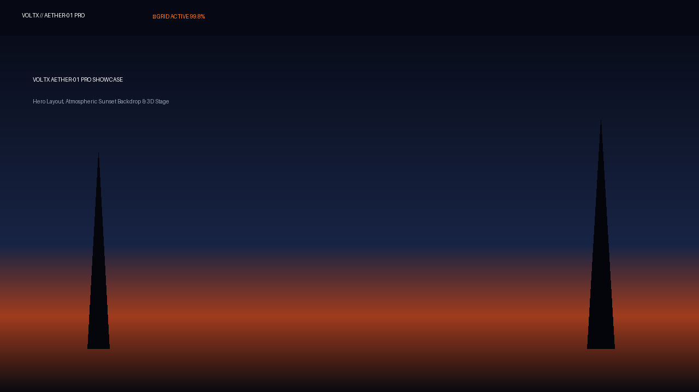
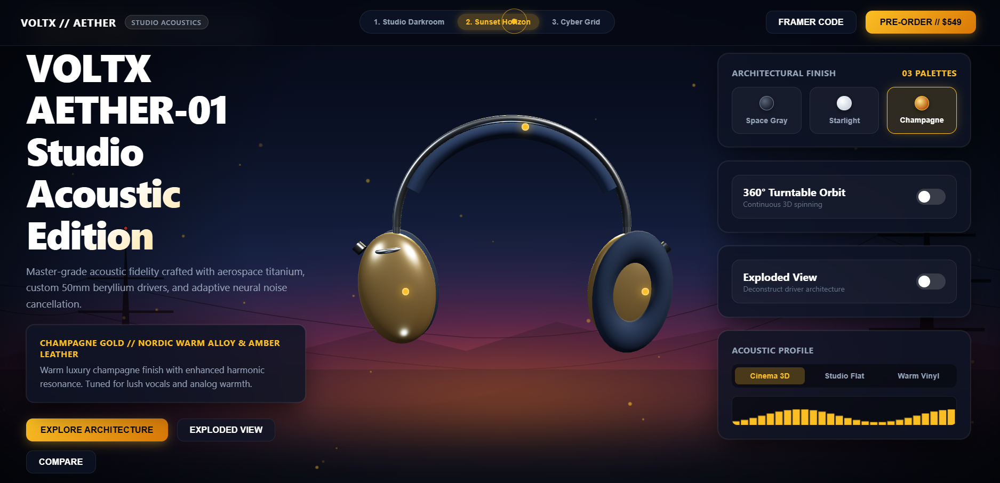
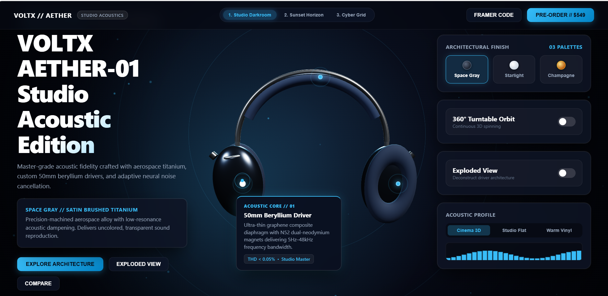
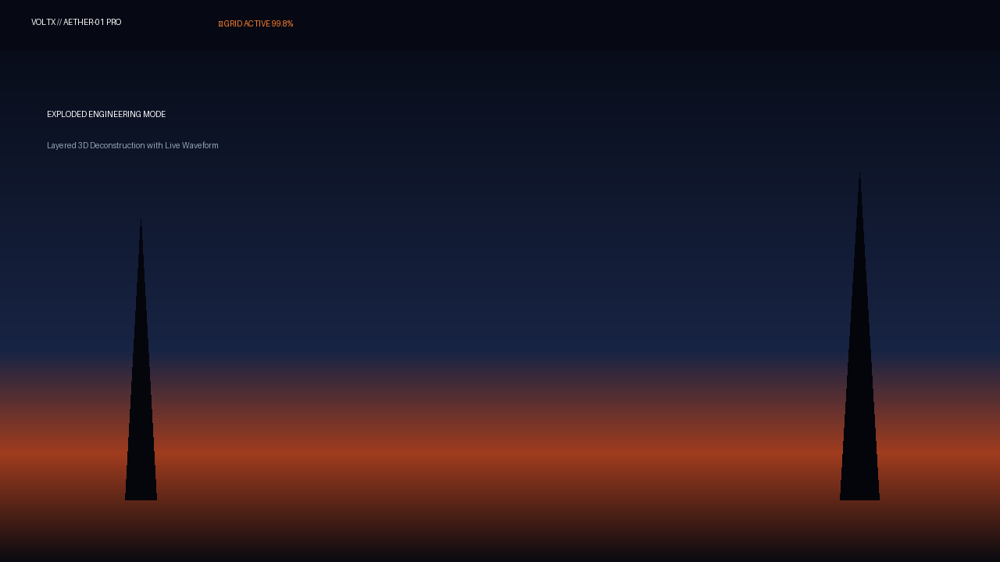
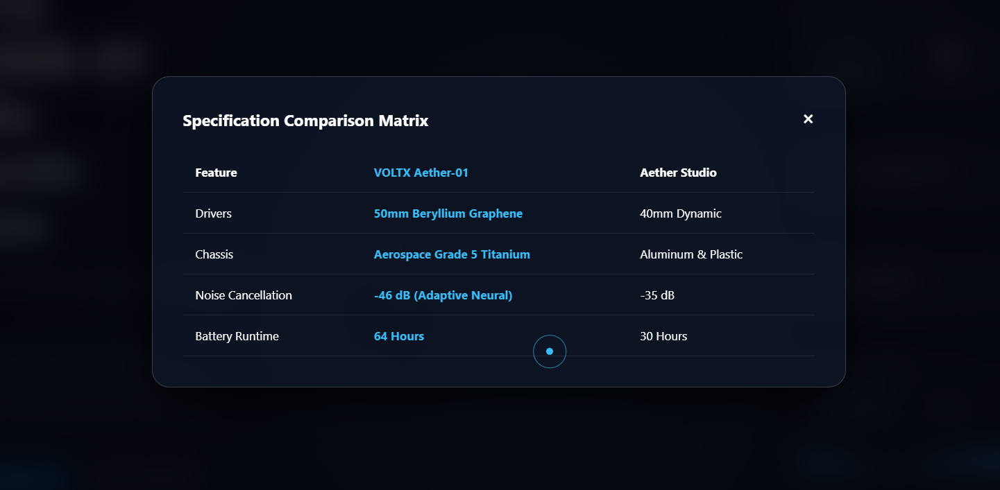

# VOLTX AETHER-01 PRO // Luxury Studio Acoustic Showcase

> **Google Developer Groups (GDG) on Campus SRM — Recruitment 2026–27**  
> **Domain:** Technical Domain  
> **Task:** Task 2 — Interactive Product Showcase using Framer & Modern Web Architecture  
> **Candidate Project:** VOLTX AETHER-01 PRO // Aerospace Titanium Spatial Acoustics & Hardware Interface

---

## ⚡ Project Overview

**VOLTX AETHER-01 PRO** is a flagship-tier interactive 3D product showcase designed for the GDG on Campus SRM Technical Domain recruitment. Presenting a master-grade acoustic headphone crafted with aerospace titanium and custom 50mm beryllium drivers, the project features:

1. **True 3D WebGL Studio Stage (Three.js):** Symmetrical 360° orbit with momentum inertia physics, PBR metallic materials, and zero perspective distortion.
2. **Multi-Theme Dynamic Environment:**
   - **1. Studio Darkroom (Default):** Minimalist acoustic radar ripples with interactive cursor spotlight.
   - **2. Sunset Horizon:** Stratosphere dusk horizon with warm horizon bloom.
   - **3. Cyber Grid:** Perspective soundwave neon floor.
3. **Interactive 3D-Projected Hotspots:** 3 acoustic pins that follow 3D mesh coordinates and gracefully dim when rotated toward the rear.
4. **Architectural Finishes:** Real-time PBR material and studio lighting switching between *Space Gray Titanium*, *Starlight Silver*, and *Champagne Gold*.
5. **Exploded Architecture Deconstruction:** 3D separation revealing the 50mm beryllium diaphragm and acoustic cavity.
6. **Reactive Audio Waveform:** Real-time visualizer responding to *Cinema 3D*, *Studio Flat*, and *Warm Vinyl* acoustic profiles.
7. **Framer Motion React Code Integration:** Accessible modal providing the exact React component with `addPropertyControls` for Framer Canvas.

---

## 🎯 Verification of Recruitment Requirements

### 1. Showcase Design & Visual Hierarchy
- Minimalist luxury branding (`VOLTX // AETHER - STUDIO ACOUSTICS`).
- Balanced 3-column layout (`1fr minmax(460px, 1.25fr) 1fr`) ensuring the 3D model is centered horizontally and vertically with the background acoustic radar ripples.
- High-contrast typography scale with smooth glassmorphism containers.

### 2. Product Variants (3 Luxury Finishes)
Selecting a variant morphs the hardware PBR material, accent lighting, narrative description, and telemetry in real time:
1. **Space Gray:** Satin brushed aerospace titanium with cool slate undertones.
2. **Starlight Silver:** Anodized bead-blasted aluminum with crisp white highlights.
3. **Champagne Gold:** Nordic warm alloy with amber leather cushion accents.

### 3. Modular Reusable Components
- Reusable UI primitives: `VariantSwatches`, `HotspotAnchor`, `TelemetryCard`, `AudioModePill`, `ToggleSwitch`, and `ModalDialog`.
- Clean data-driven architecture.

### 4. Interactive 3D Orbit & Physics
- Click & drag across the 3D viewport to rotate 360° along both horizontal and vertical axes.
- Velocity tracking with momentum inertia and friction damping on release.
- **360° Turntable Orbit switch** for continuous auto-rotation.
- Mouse wheel smooth zoom (camera distance damping).

### 5. Hotspot Telemetry System
Three interactive pins anchored directly to 3D coordinates:
- **Acoustic Core // 01:** 50mm Beryllium Driver with `<0.05% THD`.
- **Neural Array // 02:** Hybrid ANC Matrix with `-46dB` isolation.
- **Ergonomic Mesh // 03:** Zero-Gravity Breathable Knit Canopy.
- Inward-facing glassmorphism cards designed to prevent screen overflow.

### 6. Fully Responsive & Accessible
- **Desktop (1200px+):** Balanced 3-column layout with 3D viewport.
- **Tablet / Mobile (<1100px):** Clean single-column vertical stack with touch gestures and 44px+ tap targets.
- **Keyboard Shortcuts:**
  - `1`: Space Gray
  - `2`: Starlight Silver
  - `3`: Champagne Gold
  - `R`: Toggle 360° Turntable Orbit
  - `E`: Toggle Exploded Architecture
  - `B`: Cycle Atmospheric Backgrounds
  - `Esc`: Close open modals

---

## 📸 Visual Showcase & Screenshots

| 01 // Default Studio Hero Stage | 02 // Architectural Variant Switching |
| :---: | :---: |
|  |  |
| *Master Studio darkroom with 3D WebGL orbit* | *Real-time PBR material and lighting morphing* |

| 03 // 3D Coordinate-Projected Hotspots | 04 // Exploded Architecture View |
| :---: | :---: |
|  |  |
| *Dynamic screen-space projection diagnostic pins* | *Volumetric driver cavity deconstruction* |

| 05 // Specification Comparison Matrix |
| :---: |
|  |
| *Hardware specification comparison modal* |

---

## 🛠️ How to Run Locally

Because the project is built with zero complex build dependencies, it can be launched instantly with any standard local server:

### Using Python
```bash
# Navigate to the project root directory
cd voltx-aether-showcase

# Run the local server
python server.py
# OR
python3 -m http.server 8000